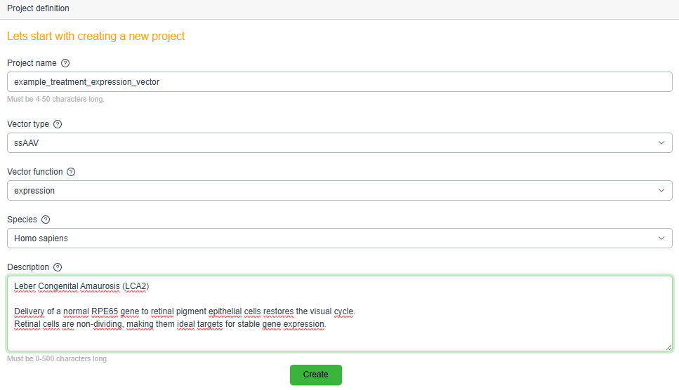
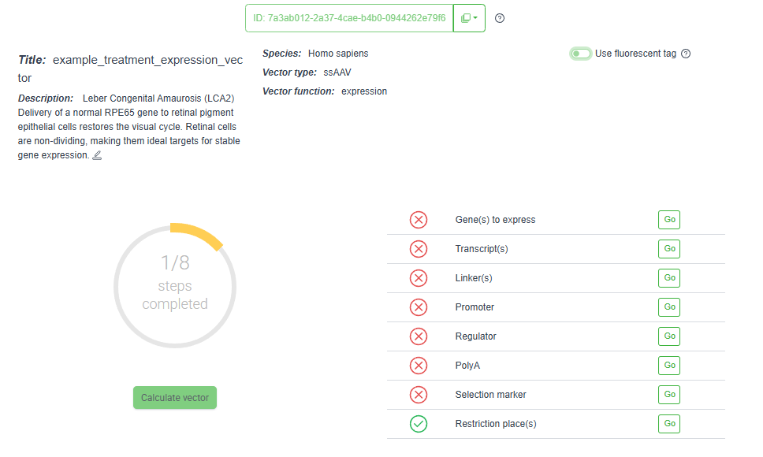
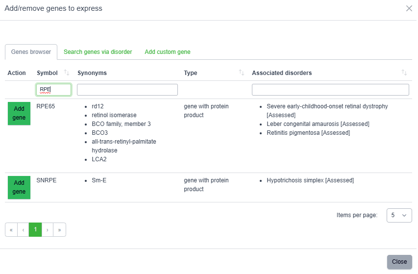
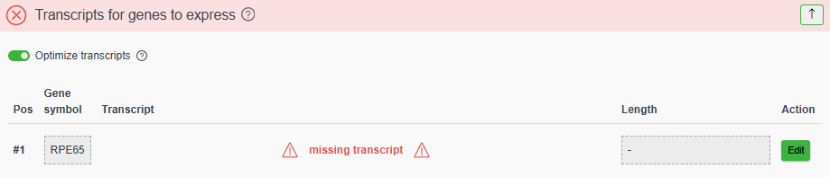
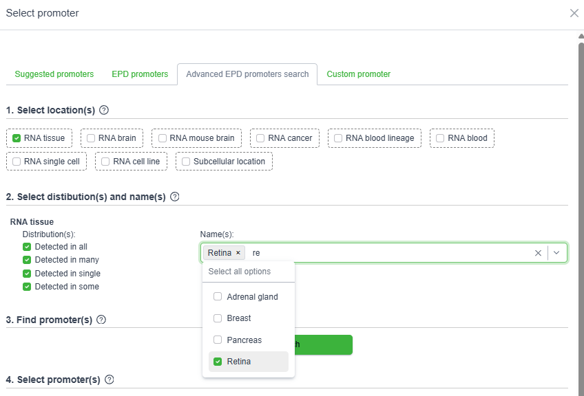
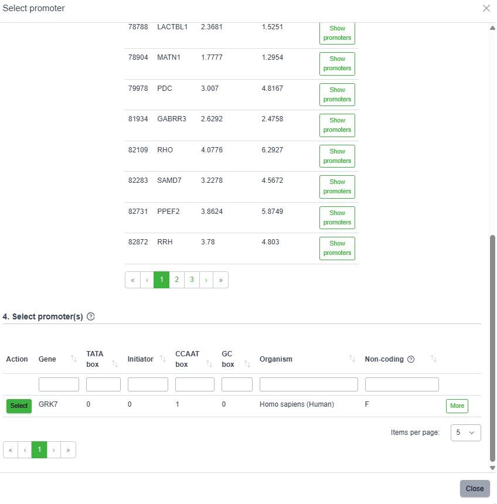
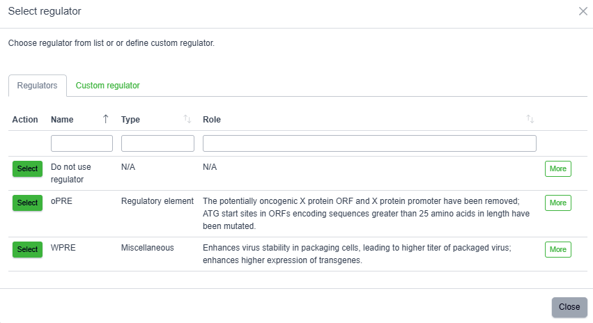
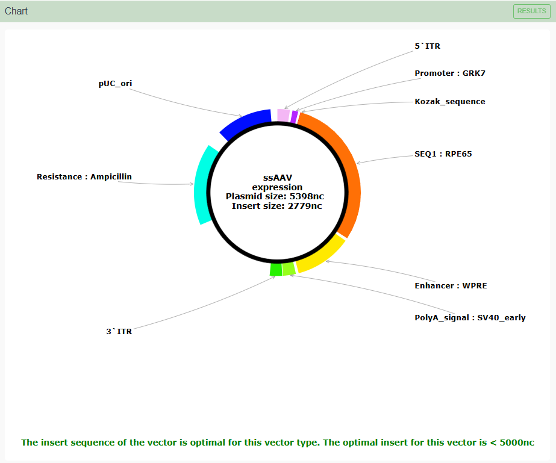
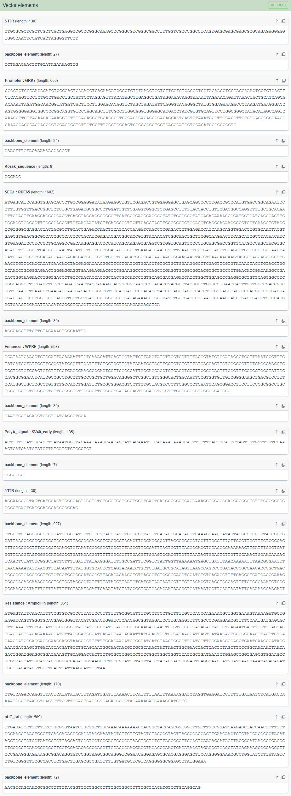
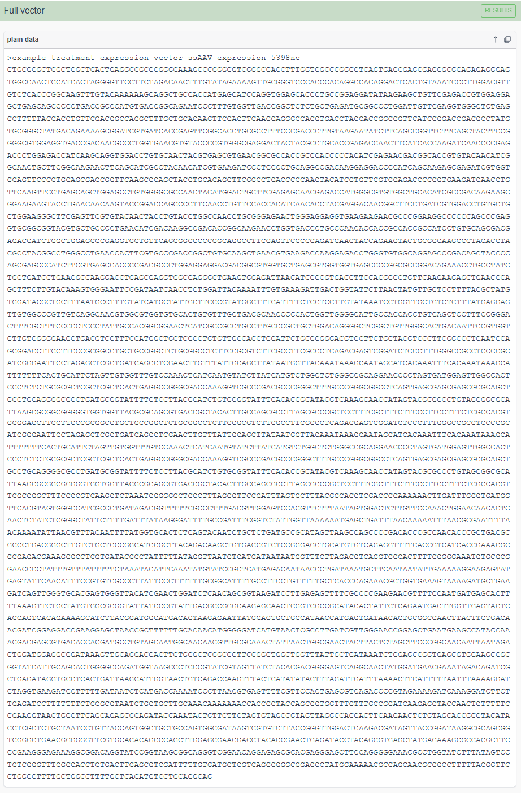

<br>

# Case Overview

---

**Leber Congenital Amaurosis (LCA2)**

Delivery of a normal *RPE65* gene to retinal pigment epithelial cells restores the visual cycle.
Retinal cells are non-dividing, making them ideal targets for stable gene expression.


---

<br>

# Project Overview


```{r echo=FALSE, out.width='90%', fig.align='center'}



```


---

<br>

# Design Workflow


```{r echo=FALSE, out.width='90%', fig.align='center'}


```


<br>

<div style="text-align:center; font-size:48px; color:#9acd32; margin:20px 0;">
⬇
</div>

<br>


```{r echo=FALSE, out.width='90%', fig.align='center'}



```


---

<br>


# Gene Selection

## Target Gene Identification


```{r echo=FALSE, out.width='90%', fig.align='center'}


```

<br>

<div style="text-align:center; font-size:48px; color:#9acd32; margin:20px 0;">
⬇
</div>

<br>

```{r echo=FALSE, out.width='90%', fig.align='center'}



```

<br>

<div style="text-align:center; font-size:48px; color:#9acd32; margin:20px 0;">
⬇
</div>

<br>

```{r echo=FALSE, out.width='90%', fig.align='center'}


```


---

<br>

## Transcript Variant Choice


```{r echo=FALSE, out.width='90%', fig.align='center'}



```

<br>

<div style="text-align:center; font-size:48px; color:#9acd32; margin:20px 0;">
⬇
</div>

<br>

```{r echo=FALSE, out.width='90%', fig.align='center'}


```

<br>

<div style="text-align:center; font-size:48px; color:#9acd32; margin:20px 0;">
⬇
</div>

<br>

```{r echo=FALSE, out.width='90%', fig.align='center'}


```


---

<br>


# Linker Selection


```{r echo=FALSE, out.width='90%', fig.align='center'}


```


---

<br>


# Promoter Selection


```{r echo=FALSE, out.width='90%', fig.align='center'}


```

<br>

<div style="text-align:center; font-size:48px; color:#9acd32; margin:20px 0;">
⬇
</div>

<br>


```{r echo=FALSE, out.width='90%', fig.align='center'}



```

<br>

<div style="text-align:center; font-size:48px; color:#9acd32; margin:20px 0;">
⬇
</div>

<br>


```{r echo=FALSE, out.width='90%', fig.align='center'}


```

<br>

<div style="text-align:center; font-size:48px; color:#9acd32; margin:20px 0;">
⬇
</div>

<br>


```{r echo=FALSE, out.width='90%', fig.align='center'}



```

---

<br>


# Regulator Selection


```{r echo=FALSE, out.width='90%', fig.align='center'}


```

<br>

<div style="text-align:center; font-size:48px; color:#9acd32; margin:20px 0;">
⬇
</div>

<br>

```{r echo=FALSE, out.width='90%', fig.align='center'}



```

<br>

<div style="text-align:center; font-size:48px; color:#9acd32; margin:20px 0;">
⬇
</div>

<br>

```{r echo=FALSE, out.width='90%', fig.align='center'}


```


---

<br>


# Polyadenylation Signal Selection


```{r echo=FALSE, out.width='90%', fig.align='center'}


```

<br>

<div style="text-align:center; font-size:48px; color:#9acd32; margin:20px 0;">
⬇
</div>

<br>

```{r echo=FALSE, out.width='90%', fig.align='center'}


```


<br>

<div style="text-align:center; font-size:48px; color:#9acd32; margin:20px 0;">
⬇
</div>

<br>


```{r echo=FALSE, out.width='90%', fig.align='center'}


```


---

<br>


# Restriction Places for Remove


```{r echo=FALSE, out.width='90%', fig.align='center'}


```


---

<br>


# Selection Marker

```{r echo=FALSE, out.width='90%', fig.align='center'}


```

<br>

<div style="text-align:center; font-size:48px; color:#9acd32; margin:20px 0;">
⬇
</div>

<br>


```{r echo=FALSE, out.width='90%', fig.align='center'}


```

<br>

<div style="text-align:center; font-size:48px; color:#9acd32; margin:20px 0;">
⬇
</div>

<br>


```{r echo=FALSE, out.width='90%', fig.align='center'}


```

---

<br>


# Calculations

```{r echo=FALSE, out.width='90%', fig.align='center'}


```

<br>

<div style="text-align:center; font-size:48px; color:#9acd32; margin:20px 0;">
⬇
</div>

<br>


```{r echo=FALSE, out.width='90%', fig.align='center'}


```

<br>

<div style="text-align:center; font-size:48px; color:#9acd32; margin:20px 0;">
⬇
</div>

<br>


```{r echo=FALSE, out.width='90%', fig.align='center'}


```

<br>

<div style="text-align:center; font-size:48px; color:#9acd32; margin:20px 0;">
⬇
</div>

<br>


```{r echo=FALSE, out.width='90%', fig.align='center'}


```

<br>

<div style="text-align:center; font-size:48px; color:#9acd32; margin:20px 0;">
⬇
</div>

<br>


```{r echo=FALSE, out.width='90%', fig.align='center'}


```


---

<br>


# Results


---


## Graphical Map of the Vector

```{r echo=FALSE, out.width='90%', fig.align='center'}



```

---

<br>


## FASTA Representation (Segmented)

```{r echo=FALSE, out.width='90%', fig.align='center'}



```

---

<br>


## FASTA Representation (Full Sequence)

```{r echo=FALSE, out.width='90%', fig.align='center'}



```


---

\

# Disclaimer

The designed therapeutic compounds presented here are solely the result of *in silico* analyses conducted using available databases, computational models, and template-based design approaches.

It should be emphasized that findings obtained through *in silico* methods are predictive in nature and therefore require further experimental validation. Critical confirmation of their actual efficacy, safety, and biological relevance must be achieved through *in vitro* studies, followed by *in vivo* investigations.

Only comprehensive experimental verification can enable a reliable assessment of the true therapeutic potential of the proposed compounds.

---

\
