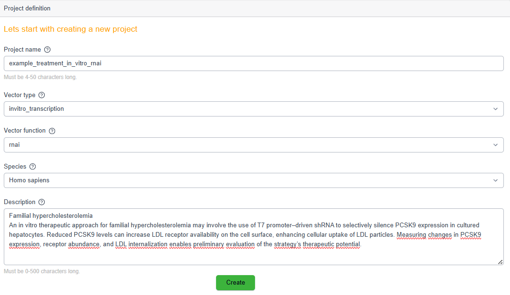
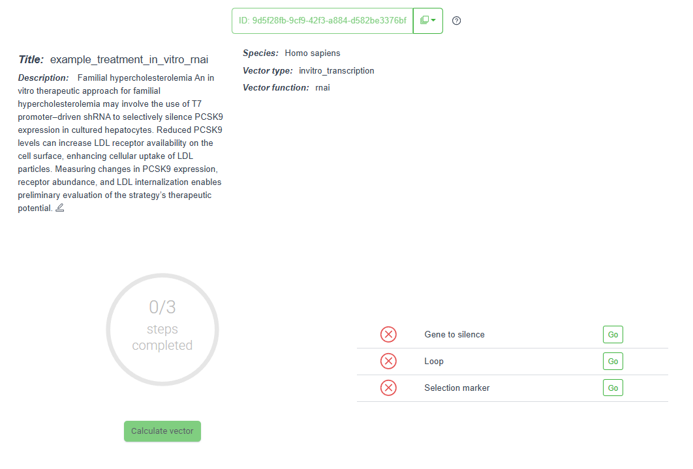
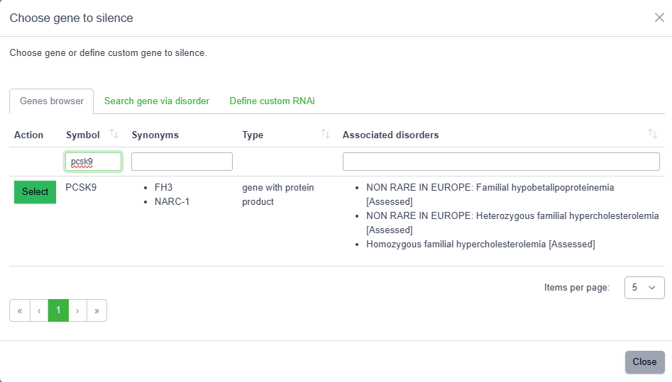
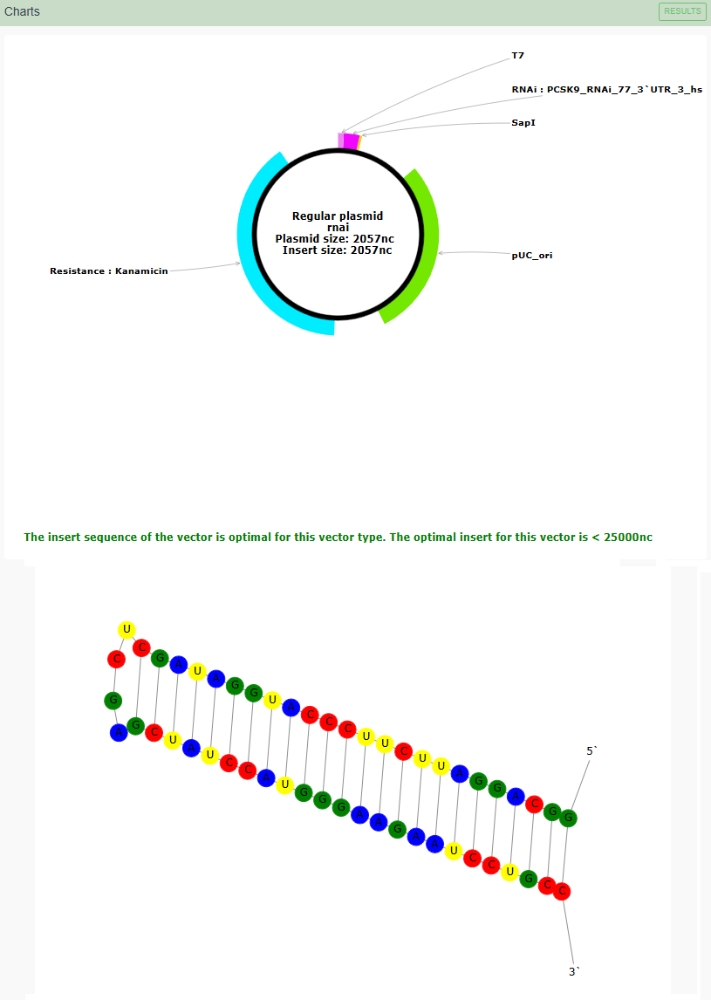
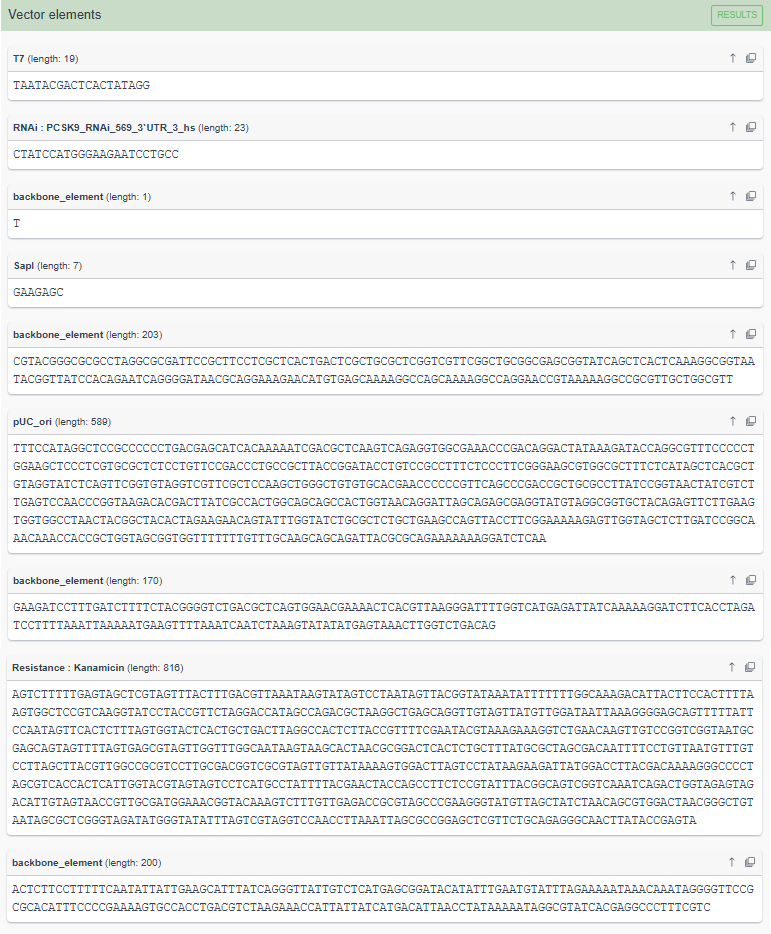
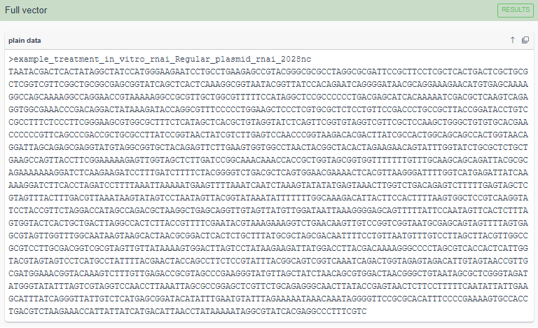

<br>

# Case Overview

---

**Familial Hypercholesterolemia**

An *in vitro* therapeutic approach for familial hypercholesterolemia may involve the use of T7 promoter-driven *shRNA* to selectively silence *PCSK9* expression in cultured hepatocytes. Reduced *PCSK9* levels can increase LDL receptor availability on the cell surface, enhancing cellular uptake of LDL particles. Measuring changes in *PCSK9* expression, receptor abundance, and LDL internalization enables preliminary evaluation of the strategy’s therapeutic potential.


---

<br>

# Project Overview


```{r echo=FALSE, out.width='90%', fig.align='center'}



```


---

<br>

# Design Workflow


```{r echo=FALSE, out.width='90%', fig.align='center'}



```


---

<br>


# Target Gene Selection for Silencing


```{r echo=FALSE, out.width='90%', fig.align='center'}


```

<br>

<div style="text-align:center; font-size:48px; color:#9acd32; margin:20px 0;">
⬇
</div>

<br>

```{r echo=FALSE, out.width='90%', fig.align='center'}



```

<br>

<div style="text-align:center; font-size:48px; color:#9acd32; margin:20px 0;">
⬇
</div>

<br>

```{r echo=FALSE, out.width='90%', fig.align='center'}


```


---

<br>


# Loop Sequence Selection


```{r echo=FALSE, out.width='90%', fig.align='center'}


```


<br>

<div style="text-align:center; font-size:48px; color:#9acd32; margin:20px 0;">
⬇
</div>

<br>


```{r echo=FALSE, out.width='90%', fig.align='center'}


```


<br>

<div style="text-align:center; font-size:48px; color:#9acd32; margin:20px 0;">
⬇
</div>

<br>


```{r echo=FALSE, out.width='90%', fig.align='center'}


```

---

<br>


# Selection Marker


```{r echo=FALSE, out.width='90%', fig.align='center'}


```

<br>

<div style="text-align:center; font-size:48px; color:#9acd32; margin:20px 0;">
⬇
</div>

<br>


```{r echo=FALSE, out.width='90%', fig.align='center'}


```

<br>

<div style="text-align:center; font-size:48px; color:#9acd32; margin:20px 0;">
⬇
</div>

<br>


```{r echo=FALSE, out.width='90%', fig.align='center'}


```


---

<br>

# Calculations

```{r echo=FALSE, out.width='90%', fig.align='center'}


```

<br>

<div style="text-align:center; font-size:48px; color:#9acd32; margin:20px 0;">
⬇
</div>

<br>


```{r echo=FALSE, out.width='90%', fig.align='center'}


```

<br>

<div style="text-align:center; font-size:48px; color:#9acd32; margin:20px 0;">
⬇
</div>

<br>


```{r echo=FALSE, out.width='90%', fig.align='center'}


```

<br>

<div style="text-align:center; font-size:48px; color:#9acd32; margin:20px 0;">
⬇
</div>

<br>


```{r echo=FALSE, out.width='90%', fig.align='center'}


```

---

<br>


# Results


---


## Graphical Map of the Vector & shRNA

```{r echo=FALSE, out.width='90%', fig.align='center'}



```

---

<br>


## FASTA Representation (Segmented)

```{r echo=FALSE, out.width='90%', fig.align='center'}



```

---

<br>


## FASTA Representation (Full Sequence)

```{r echo=FALSE, out.width='90%', fig.align='center'}



```


---

\

# Disclaimer

The designed therapeutic compounds presented here are solely the result of *in silico* analyses conducted using available databases, computational models, and template-based design approaches.

It should be emphasized that findings obtained through *in silico* methods are predictive in nature and therefore require further experimental validation. Critical confirmation of their actual efficacy, safety, and biological relevance must be achieved through *in vitro* studies, followed by *in vivo* investigations.

Only comprehensive experimental verification can enable a reliable assessment of the true therapeutic potential of the proposed compounds.

---

\
